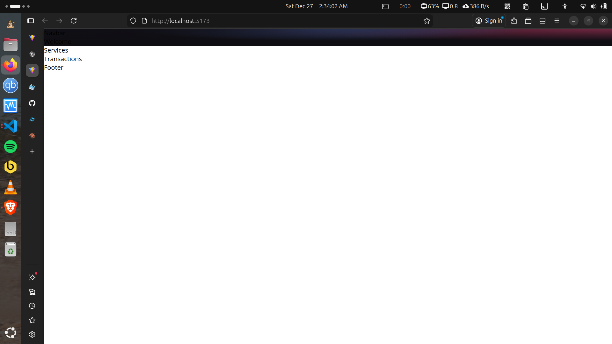
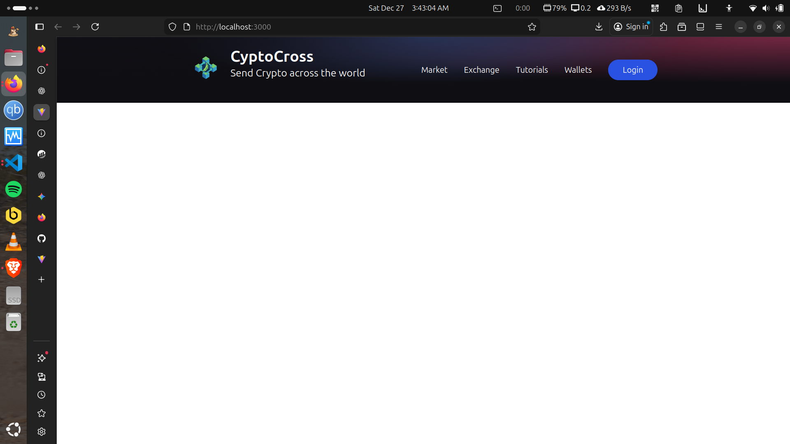

# crypto-cross-web3-ethereum-transfer-dapp-fullstack-suite

> A full-stack decentralized application (DApp) for sending Ethereum transactions through the blockchain with a modern React frontend and Solidity smart contracts.


- Author: [Kintsugi-Programmer](https://github.com/kintsugi-programmer)

> Disclaimer: The content presented here is a curated blend of my personal learning journey, experiences, open-source documentation, and invaluable knowledge gained from diverse sources. I do not claim sole ownership over all the material; this is a community-driven effort to learn, share, and grow together.

---

## 📋 Table of Contents

- [crypto-cross-web3-ethereum-transfer-dapp-fullstack-suite](#crypto-cross-web3-ethereum-transfer-dapp-fullstack-suite)
  - [📋 Table of Contents](#-table-of-contents)
  - [🎯 Overview](#-overview)
  - [✨ Features](#-features)
    - [Core Functionality](#core-functionality)
    - [Technical Features](#technical-features)
  - [🛠 Tech Stack](#-tech-stack)
    - [Frontend](#frontend)
    - [Blockchain](#blockchain)
    - [Deployment](#deployment)
    - [APIs](#apis)
  - [🏗 Architecture](#-architecture)
  - [📦 Prerequisites](#-prerequisites)
  - [🚀 Phase 1: Environment Setup](#-phase-1-environment-setup)
    - [Step 1.1: Create Project Structure](#step-11-create-project-structure)
    - [Step 1.2: Initialize Frontend with Vite](#step-12-initialize-frontend-with-vite)
    - [Step 1.3: Install and Configure Tailwind CSS](#step-13-install-and-configure-tailwind-css)
    - [Step: init App.jsx as Arrow Function.](#step-init-appjsx-as-arrow-function)
    - [Step 1.4: Initialize Smart Contract Environment](#step-14-initialize-smart-contract-environment)
  - [🎨 Phase 2: Frontend Development](#-phase-2-frontend-development)
    - [Step 2.1: Create Component Structure](#step-21-create-component-structure)
    - [Step 2.2: Build Main App Component](#step-22-build-main-app-component)
    - [Step 2.3: Build Navbar Component](#step-23-build-navbar-component)
    - [Step 2.4: Build Welcome Component (Transaction Form)](#step-24-build-welcome-component-transaction-form)
    - [Step 2.5: Build Remaining Components](#step-25-build-remaining-components)
    - [Step 2.6: Create Utility Functions](#step-26-create-utility-functions)
  - [⛓ Phase 3: Smart Contract Development](#-phase-3-smart-contract-development)
    - [Step 3.1: Write Solidity Smart Contract](#step-31-write-solidity-smart-contract)
    - [Step 3.2: Configure Hardhat](#step-32-configure-hardhat)
    - [Step 3.3: Create Deployment Script](#step-33-create-deployment-script)
    - [Step 3.4: Compile and Deploy](#step-34-compile-and-deploy)
  - [🔗 Phase 4: Blockchain Integration](#-phase-4-blockchain-integration)
    - [Step 4.1: Extract Contract ABI](#step-41-extract-contract-abi)
    - [Step 4.2: Create Constants File](#step-42-create-constants-file)
    - [Step 4.3: Build Transaction Context](#step-43-build-transaction-context)
    - [Step 4.4: Wrap App with Context](#step-44-wrap-app-with-context)
    - [Step 4.5: Create Giphy Hook](#step-45-create-giphy-hook)
  - [🚀 Phase 5: Deployment](#-phase-5-deployment)
    - [Step 5.1: Build Production Bundle](#step-51-build-production-bundle)
    - [Step 5.2: Deploy to Hostinger](#step-52-deploy-to-hostinger)
    - [Step 5.3: Environment Variables (Production)](#step-53-environment-variables-production)
  - [📁 Project Structure](#-project-structure)
  - [🧠 Key Concepts](#-key-concepts)
    - [Blockchain Basics](#blockchain-basics)
    - [Smart Contract Concepts](#smart-contract-concepts)
    - [Web3 Integration](#web3-integration)
  - [🐛 Troubleshooting](#-troubleshooting)
    - [Common Issues](#common-issues)
    - [Debug Tips](#debug-tips)
  - [🎓 Learning Resources](#-learning-resources)
  - [🤝 Contributing](#-contributing)
  - [📄 License](#-license)
  - [🙏 Acknowledgments](#-acknowledgments)

---

## 🎯 Overview

This project is a comprehensive Web 3.0 blockchain application that enables users to:
- Send Ethereum across the blockchain network
- Attach messages, keywords, and GIFs to transactions
- View transaction history permanently stored on-chain
- Connect via MetaMask wallet
- Experience a modern, responsive UI built with React and Tailwind CSS

**Live Demo:** [cryptocross.vercel.app](https://cryptocross.vercel.app)

---

## ✨ Features

### Core Functionality
- **Blockchain Transactions**: Send real Ethereum (ETH) through the Ethereum network
- **MetaMask Integration**: Secure wallet connection and transaction signing
- **Smart Contract Interaction**: Store transaction data permanently on blockchain
- **Transaction History**: Retrieve and display all past transactions
- **GIF Integration**: Attach contextual GIFs to transactions via Giphy API
- **Responsive Design**: Fully responsive UI that works on desktop and mobile

### Technical Features
- **Gas Fee Management**: Automatic gas estimation and handling
- **Network Switching**: Support for multiple Ethereum networks (Mainnet, Ropsten, Goerli)
- **Real-time Updates**: Live transaction status and confirmations
- **Error Handling**: Comprehensive error handling for blockchain operations
- **Loading States**: User-friendly loading indicators during blockchain interactions

---

## 🛠 Tech Stack

### Frontend
- **Vite** (v4.0+) - Lightning-fast build tool and dev server
- **React** (v18+) - UI component library
- **Tailwind CSS** ~~(v3+)~~ (v4+) - Utility-first CSS framework 
- **React Icons** - Icon components
- **Ethers.js** (v5.7+) - Ethereum JavaScript library

### Blockchain
- **Solidity** (v0.8.0) - Smart contract programming language
- **Hardhat** - Ethereum development environment
- **MetaMask** - Browser wallet extension
- **Alchemy** - Blockchain infrastructure provider

### Deployment
- **Hostinger** - Web hosting provider
- **SSL Certificate** - HTTPS security

### APIs
- **Giphy API** - GIF search and retrieval

---

## 🏗 Architecture

```
┌─────────────────────────────────────────────────────────────┐
│                         Frontend (React)                    │
│  ┌──────────────┐  ┌──────────────┐  ┌──────────────┐       │
│  │   Navbar     │  │   Welcome    │  │  Services    │       │
│  └──────────────┘  └──────────────┘  └──────────────┘       │
│  ┌──────────────┐  ┌──────────────┐  ┌──────────────┐       │
│  │Transactions  │  │    Footer    │  │    Loader    │       │
│  └──────────────┘  └──────────────┘  └──────────────┘       │
└─────────────────────────────────────────────────────────────┘
                              │
                              ▼
┌─────────────────────────────────────────────────────────────┐
│                   Context Layer (React Context)             │
│                  TransactionContext.jsx                     │
│  - Wallet Connection     - Send Transactions                │
│  - Fetch Transactions    - Form State Management            │
└─────────────────────────────────────────────────────────────┘
                              │
                              ▼
┌─────────────────────────────────────────────────────────────┐
│                      Ethers.js Layer                        │
│  - Web3Provider          - Contract Instance                │
│  - Signer                - Transaction Handling             │
└─────────────────────────────────────────────────────────────┘
                              │
                              ▼
┌─────────────────────────────────────────────────────────────┐
│                        MetaMask                             │
│  - Account Management    - Transaction Signing              │
│  - Network Selection     - Gas Fee Approval                 │
└─────────────────────────────────────────────────────────────┘
                              │
                              ▼
┌─────────────────────────────────────────────────────────────┐
│                    Ethereum Network                         │
│                (Ropsten/Goerli/Mainnet)                     │
└─────────────────────────────────────────────────────────────┘
                              │
                              ▼
┌─────────────────────────────────────────────────────────────┐
│                  Smart Contract (Solidity)                  │
│              Transactions.sol (Deployed)                    │
│  - addToBlockchain()     - getAllTransactions()             │
│  - getTransactionCount() - TransferStruct[]                 │
└─────────────────────────────────────────────────────────────┘
```

---

## 📦 Prerequisites

Before starting, ensure you have:

1. **Node.js** (v14.0.0 or higher)
   ```bash
   node --version  # Should be v14+
   npm --version   # Should be 6+
   ```

2. **MetaMask Browser Extension**
   - Install from [metamask.io](https://metamask.io)
   - Create a wallet and save your seed phrase securely
   - Switch to Ropsten Test Network

3. **Test Ethereum**
   - Get free Ropsten ETH from [faucet](https://faucet.ropsten.be/)
   - You'll need ~0.5 ETH for testing

4. **Alchemy Account**
   - Sign up at [alchemy.com](https://www.alchemy.com)
   - Create a new app on Ropsten network
   - Copy your API key

5. **Giphy API Key**
   - Create account at [developers.giphy.com](https://developers.giphy.com)
   - Create an app and get API key

6. **Code Editor**
   - VS Code recommended with Solidity extension

---

## 🚀 Phase 1: Environment Setup

### Step 1.1: Create Project Structure

```bash
# Create main project folder
mkdir web3-blockchain-app
cd web3-blockchain-app

# Create two main directories
mkdir client smart_contract
```

**Why two directories?**
- `client/` - React frontend application
- `smart_contract/` - Solidity smart contract and deployment scripts

### Step 1.2: Initialize Frontend with Vite

```bash
# Navigate to client folder
cd client

# Create Vite + React app
npm init vite@latest ./ -- --template react
```

> chore(client): Scaffolding Vite React Latest

```bash

# Install dependencies
npm install

# Install additional packages
npm install ethers react-icons

# Start dev server to verify
npm run dev
```

**What happens here:**
- Vite creates a minimal React project (faster than Create React App)
- Installs React, ReactDOM, and Vite tooling
- `ethers` - For blockchain & our smart contract interaction
- `react-icons` - For UI icons

**Expected Output:**
```
VITE v4.x.x  ready in 123 ms

➜  Local:   http://localhost:5173/
```

### Step 1.3: Install and Configure Tailwind CSS

```bash
# Still in client folder
npm install tailwindcss @tailwindcss/vite # leave it
npm install -D postcss autoprefixer # leave it
npm install tailwindcss @tailwindcss/vite

# Generate config files
npx tailwindcss init -p # leave it
```

> Tailwind v4 is config-optional. You do NOT need: `tailwind.config.js`,`postcss.config.js`,`tailwindcss init -p` !!!

**Edit `tailwind.config.js`: leave it**
```javascript
/** @type {import('tailwindcss').Config} */ // Provides TypeScript Intellisense/typings for the config object
export default {
  // Specifies the paths to all of your template files (HTML, JS, TS, etc.)
  content: [
    "./index.html", // Scans the root HTML file for Tailwind classes
    "./src/**/*.{js,ts,jsx,tsx}", // Scans all files in the src folder with these extensions
  ],
  theme: {
    // 'extend' allows you to add new styles without overriding the default Tailwind theme
    extend: {
      screens: {
        mf: "990px", // Defines a custom responsive breakpoint at 990 pixels
      },
      keyframes: {
        // Defines the raw CSS keyframes for a custom animation
        "slide-in": {
          "0%": {
            transform: "translateX(120%)", // Starts the element off-screen to the right
          },
          "100%": {
            transform: "translateX(0%)", // Ends the element at its natural position
          },
        },
      },
      animation: {
        // Links the keyframes above to a usable utility class: 'animate-slide-in'
        "slide-in": "slide-in 0.5s ease-out", // Sets duration to 0.5s with a smooth exit
      },
    },
  },
  plugins: [], // Used to register third-party plugins (like forms or typography)
}
```

**Edit `src/index.css`: (custom css)**
```css
/* Imports the 'Open Sans' font family from Google Fonts with various weights */
@import url("https://fonts.googleapis.com/css2?family=Open+Sans:wght@300;400;500;600;700&display=swap");

/* Global reset and box-sizing for consistent layout calculation */
* html {
  padding: 0;
  margin: 0;
  box-sizing: border-box; /* Includes padding/border in the element's total width/height */
}

/* Base body styles */
body {
  margin: 0;
  font-family: "Open Sans", sans-serif;
  -webkit-font-smoothing: antialiased; /* Smoother font rendering for Chrome/Safari */
  -moz-osx-font-smoothing: grayscale; /* Smoother font rendering for Firefox */
}

/* Background for the Welcome section: Deep dark base with three subtle top-aligned glows */
.gradient-bg-welcome {
  background-color:#0f0e13;
  background-image: 
    radial-gradient(at 0% 0%, hsla(253,16%,7%,1) 0, transparent 50%),   /* Top-left dark glow */
    radial-gradient(at 50% 0%, hsla(225,39%,30%,1) 0, transparent 50%),  /* Top-center blue glow */
    radial-gradient(at 100% 0%, hsla(339,49%,30%,1) 0, transparent 50%); /* Top-right pinkish glow */
}

/* Background for the Services section: Dark base with a centered bottom glow */
.gradient-bg-services {
  background-color:#0f0e13;
  background-image: 
    radial-gradient(at 0% 0%, hsla(253,16%,7%,1) 0, transparent 50%), 
    radial-gradient(at 50% 100%, hsla(225,39%,25%,1) 0, transparent 50%); /* Bottom-center blue glow */
}

/* Background for Transactions: Dark base with glows at bottom-left and top-center */
.gradient-bg-transactions {
  background-color: #0f0e13;
  background-image: 
    radial-gradient(at 0% 100%, hsla(253,16%,7%,1) 0, transparent 50%), 
    radial-gradient(at 50% 0%, hsla(225,39%,25%,1) 0, transparent 50%);
}

/* Background for Footer: Dark base with a glow coming from "underneath" the screen */
.gradient-bg-footer {
  background-color: #0f0e13;
  background-image: 
    radial-gradient(at 0% 100%, hsla(253,16%,7%,1) 0, transparent 53%), 
    radial-gradient(at 50% 150%, hsla(339,49%,30%,1) 0, transparent 50%); /* Overflowing bottom glow */
}

/* Blue-tinted frosted glass effect */
.blue-glassmorphism {
  background: rgb(39, 51, 89, 0.4); /* Semi-transparent blue */
  border-radius: 16px;
  box-shadow: 0 4px 30px rgba(0, 0, 0, 0.2); /* Deep shadow for depth */
  backdrop-filter: blur(5px); /* Blurs content behind the element */
  -webkit-backdrop-filter: blur(5px); /* Safari support for blur */
  border: 1px solid rgba(0, 0, 0, 0.3); /* Subtle dark border */
}

/* White-tinted frosted glass effect (lighter and more transparent) */
.white-glassmorphism {
  background: rgba(255, 255, 255, 0.05); /* Very faint white tint */
  border-radius: 16px;
  backdrop-filter: blur(5px);
  -webkit-backdrop-filter: blur(5px);
  border: 1px solid rgba(255, 255, 255, 0.3); /* Lighter border to catch the light */
}

/* Multi-colored Ethereum-style card background using 7 overlapping radial gradients */
.eth-card {
  background-color:#a099ff;
  background-image: 
    radial-gradient(at 83% 67%, rgb(152, 231, 156) 0, transparent 58%), 
    radial-gradient(at 67% 20%, hsla(357,94%,71%,1) 0, transparent 59%), 
    radial-gradient(at 88% 35%, hsla(222,81%,65%,1) 0, transparent 50%), 
    radial-gradient(at 31% 91%, hsla(9,61%,61%,1) 0, transparent 52%), 
    radial-gradient(at 27% 71%, hsla(336,91%,65%,1) 0, transparent 49%), 
    radial-gradient(at 74% 89%, hsla(30,98%,65%,1) 0, transparent 51%), 
    radial-gradient(at 53% 75%, hsla(174,94%,68%,1) 0, transparent 45%);
}

/* Masks text so that the background gradient shows through the letters */
.text-gradient {
  background-color: #fff;
  background-image: radial-gradient(at 4% 36%, hsla(0,0%,100%,1) 0, transparent 53%), radial-gradient(at 100% 60%, rgb(0, 0, 0) 0, transparent 50%);
  -webkit-background-clip: text; /* Clips background to text shape */
  -webkit-text-fill-color: transparent; /* Makes original text color transparent */
}

/* Tailwind CSS Directives to inject base styles, components, and utility classes */
@tailwind base;
@tailwind components;
@tailwind utilities;
```

**Why Tailwind?**
- Write styles directly in JSX without separate CSS files
- Purges unused styles automatically (smaller bundle)
- Consistent design system with utility classes

> feat(client): Scaffolding tailwind

### Step: init App.jsx as Arrow Function.

```jsx
// import { useState } from 'react'
// import reactLogo from './assets/react.svg'
// import viteLogo from '/vite.svg'
import './App.css'

// function App() {
// //  const [count, setCount] = useState(0)

//   return (
//     <>
//       <div>
//       </div>
//     </>
//   )
// }

// new App function ARROW function
const App = () => {
  return (
    <div className="App">
      <h1>CryptoCross</h1>
      Your Favourite Crypto Transfer Dapp !!!
    </div>
  )
}

export default App
```

> chore(client): init App.jsx as Arrow Function.

### Step 1.4: Initialize Smart Contract Environment

```bash
# Navigate to smart_contract folder
cd ../smart_contract

# Initialize npm
npm init -y

# Install Hardhat and dependencies
npm install --save-dev hardhat @nomiclabs/hardhat-waffle ethereum-waffle chai @nomiclabs/hardhat-ethers ethers

# Initialize Hardhat
npx hardhat --init
```

* **hardhat**: Development environment for compiling, testing, and deploying smart contracts
* **@nomiclabs/hardhat-waffle**: Hardhat plugin to use Waffle testing framework with Hardhat
* **ethereum-waffle**: Smart contract testing framework built on ethers.js
* **chai**: Assertion library used in tests (e.g., expect, should)
* **@nomiclabs/hardhat-ethers**: Hardhat plugin that integrates ethers.js with Hardhat runtime
* **ethers**: JavaScript library for interacting with Ethereum blockchain & smart contracts

> 20 vulnerabilities (1 low, 11 moderate, 5 high, 3 critical): What you’re seeing are warnings, not errors. Your install completed successfully.

> some fix
```bash
npm install --save-dev "@nomicfoundation/hardhat-chai-matchers@^2.0.0" "@nomicfoundation/hardhat-ethers@^3.0.0" "@nomicfoundation/hardhat-ignition@^0.15.0" "@nomicfoundation/hardhat-ignition-ethers@^0.15.0" "@nomicfoundation/hardhat-network-helpers@^1.0.0" "@nomicfoundation/hardhat-toolbox@^6.0.0" "@nomicfoundation/hardhat-verify@^2.0.0" "@typechain/ethers-v6@^0.5.0" "@typechain/hardhat@^9.0.0" "hardhat-gas-reporter@^2.3.0" "solidity-coverage@^0.8.0" "typechain@^8.3.0" --legacy-peer-deps
```

**Select these options:**
- ✔ Create a basic sample project
- ✔ Hardhat project root: (current directory)
- ✔ Add .gitignore? Yes

**What gets installed:**
- `hardhat` - Ethereum development environment
- `@nomiclabs/hardhat-ethers` - Ethers.js Hardhat plugin
- `ethereum-waffle` - Testing framework for smart contracts
- `chai` - Assertion library for tests

**Expected structure:**
```
smart_contract/
├── contracts/
│   └── Greeter.sol (delete this)
├── scripts/
│   └── sample-script.js (we'll modify)
├── test/
├── hardhat.config.js
└── package.json
```

> chore(smart_contract): initialize smart contract project with Hardhat and create Lock contract tests & relevant deps

---

## 🎨 Phase 2: Frontend Development

### Step 2.1: Create Component Structure

```bash
# In client/src folder
cd client/src
mkdir components utils context hooks
```

**Create these component files:**

```bash
# In components folder
touch components/Navbar.jsx
touch components/Welcome.jsx
touch components/Services.jsx
touch components/Transactions.jsx
touch components/Footer.jsx
touch components/Loader.jsx
touch components/index.js
```

> install vsc extension https://marketplace.visualstudio.com/items?itemName=dsznajder.es7-react-js-snippets
> at each component do `rafce` and use generated boilerplate

**`components/index.js` (Barrel export):**
```javascript
export { default as Navbar } from './Navbar';
export { default as Welcome } from './Welcome';
export { default as Services } from './Services';
export { default as Transactions } from './Transactions';
export { default as Footer } from './Footer';
export { default as Loader } from './Loader';
```

**Why barrel exports?**
- Import all components from one place: `import { Navbar, Welcome } from './components'`
- Cleaner imports throughout the app

### Step 2.2: Build Main App Component

**`src/App.jsx`:**
```javascript
import { Navbar, Welcome, Services, Transactions, Footer } from './components';

const App = () => {
  return (
    <div className="min-h-screen">
      <div className="gradient-bg-welcome">
        <Navbar />
        <Welcome />
      </div>
      <Services />
      <Transactions />
      <Footer />
    </div>
  );
}

export default App;
```

**Layout explanation:**
- `gradient-bg-welcome` wraps Navbar + Welcome for unified background
- Each section is a separate component for modularity
- Tailwind's `min-h-screen` ensures full viewport height

> clear `App.css`



> feat(client): add initial React component structure and main App layout for Phase 2
> - created components folder structure
> - added Navbar, Welcome, Services, Transactions, Footer, Loader components
> - added barrel exports in components/index.js
> - implemented main App.jsx layout with gradient welcome section
> - prepared project for further UI development
 

### Step 2.3: Build Navbar Component

```bash
npm install react-icons --save
```

**`components/Navbar.jsx`:**
```javascript
import React from "react";
// Importing specific icons from the 'react-icons' library
import { HiMenuAlt4 } from "react-icons/hi"; // Hamburger menu icon
import { AiOutlineClose } from "react-icons/ai"; // Close/X icon

// Importing the logo image asset
import logo from "../../images/logo.png";

// A reusable sub-component for individual navigation links
const NavBarItem = ({ title, classprops }) => (
  // Uses template literals to combine default styles with custom classes passed via props
  <li className={`mx-4 cursor-pointer ${classprops}`}>{title}</li>
);

const Navbar = () => {
  // State hook to track whether the mobile menu is open (true) or closed (false)
  const [toggleMenu, setToggleMenu] = React.useState(false);

  return (
    // 'w-full' makes the nav span the whole width; 'md:justify-center' centers items on desktop
    <nav className="w-full flex md:justify-center justify-between items-center p-4">
      {/* Left side: Logo and Brand Name container */}
      <div className="md:flex-[0.5] flex-initial justify-center items-center">
        <div className="flex">
          
          <h1 className="text-3xl text-white py-1">
            <span className="font-bold">CyptoCross</span><br /> 
            <div className="text-xl">Send Crypto across the world</div>
          </h1>
        </div>
      </div>

      {/* Desktop Navigation: Hidden on mobile ('hidden'), flexbox on medium screens and up ('md:flex') */}
      <ul className="text-white md:flex hidden list-none flex-row justify-between items-center flex-initial">
        {/* Mapping through an array to dynamically generate Nav Items */}
        {["Market", "Exchange", "Tutorials", "Wallets"].map((item, index) => (
          <NavBarItem key={item + index} title={item} />
        ))}
        {/* Styled Login Button */}
        <li className="bg-[#2952e3] py-2 px-7 mx-4 rounded-full cursor-pointer hover:bg-[#2546bd]">
          Login
        </li>
      </ul>

      {/* Mobile Menu logic: Uses 'relative' positioning for the menu icon */}
      <div className="flex relative">
        {/* If toggleMenu is false, show the Hamburger icon */}
        {!toggleMenu && (
          <HiMenuAlt4 fontSize={28} className="text-white md:hidden cursor-pointer" onClick={() => setToggleMenu(true)} />
        )}
        {/* If toggleMenu is true, show the Close icon */}
        {toggleMenu && (
          <AiOutlineClose fontSize={28} className="text-white md:hidden cursor-pointer" onClick={() => setToggleMenu(false)} />
        )}
        {/* The Mobile Sidebar Overlay */}
        {toggleMenu && (
          <ul
            // 'fixed' takes it out of document flow; 'w-[70vw]' makes it cover 70% of screen width
            // 'blue-glassmorphism' applies the custom CSS glass effect from your stylesheet
            // 'animate-slide-in' triggers the Tailwind animation we configured earlier
            className="z-10 fixed -top-0 -right-2 p-3 w-[70vw] h-screen shadow-2xl md:hidden list-none
            flex flex-col justify-start items-end rounded-md blue-glassmorphism text-white animate-slide-in"
          >
            {/* Close button inside the sidebar */}
            <li className="text-xl w-full my-2">
              <AiOutlineClose onClick={() => setToggleMenu(false)} />
            </li>
            {/* Repeating the map for mobile links with larger text and vertical spacing */}
            {["Market", "Exchange", "Tutorials", "Wallets"].map(
              (item, index) => <NavBarItem key={item + index} title={item} classprops="my-2 text-lg" />,
            )}
          </ul>
        )}
      </div>
    </nav>
  );
};

export default Navbar;
```

**Key features:**
- **Responsive**: Desktop horizontal menu, mobile slide-in menu
- **Glassmorphism**: Semi-transparent mobile menu with blur effect
- **State management**: `toggleMenu` controls mobile menu visibility
- **Animation**: `animate-slide-in` custom Tailwind animation

> feat(client): navbar component

> chore: downgrade dependencies and tooling to legacy versions
> - React 19 ➝ React 17
> - Vite 7 ➝ Vite 2
> - Tailwind 4 ➝ Tailwind 2
> - Ethers 6 ➝ Ethers 5
> - Updated eslint config and plugins
> - Replaced preview script name with serve
> - Removed TypeScript type packages



### Step 2.4: Build Welcome Component (Transaction Form)

**`components/Welcome.jsx`:**
```javascript
import { useContext } from 'react';
import { AiFillPlayCircle } from 'react-icons/ai';
import { SiEthereum } from 'react-icons/si';
import { BsInfoCircle } from 'react-icons/bs';
import { TransactionContext } from '../context/TransactionContext';
import { shortenAddress } from '../utils/shortenAddress';
import Loader from './Loader';

const Input = ({ placeholder, name, type, value, handleChange }) => (
  <input
    placeholder={placeholder}
    type={type}
    step="0.0001"
    value={value}
    onChange={(e) => handleChange(e, name)}
    className="my-2 w-full rounded-sm p-2 outline-none bg-transparent text-white border-none text-sm white-glassmorphism"
  />
);

const Welcome = () => {
  const {
    connectWallet,
    currentAccount,
    formData,
    sendTransaction,
    handleChange,
    isLoading,
  } = useContext(TransactionContext);

  const handleSubmit = (e) => {
    const { addressTo, amount, keyword, message } = formData;
    e.preventDefault();

    if (!addressTo || !amount || !keyword || !message) return;

    sendTransaction();
  };

  return (
    <div className="flex w-full justify-center items-center">
      <div className="flex mf:flex-row flex-col items-start justify-between md:p-20 py-12 px-4">
        {/* Left Side: Heading and Form */}
        <div className="flex flex-1 justify-start flex-col mf:mr-10">
          <h1 className="text-3xl sm:text-5xl text-white text-gradient py-1">
            Send Crypto <br /> across the world
          </h1>
          <p className="text-left mt-5 text-white font-light md:w-9/12 w-11/12 text-base">
            Explore the crypto world. Buy and sell cryptocurrencies easily on Crypt.
          </p>

          {!currentAccount && (
            <button
              type="button"
              onClick={connectWallet}
              className="flex flex-row justify-center items-center my-5 bg-[#2952e3] p-3 rounded-full cursor-pointer hover:bg-[#2546bd]"
            >
              <p className="text-white text-base font-semibold">Connect Wallet</p>
            </button>
          )}

          {/* Feature Grid */}
          <div className="grid sm:grid-cols-3 grid-cols-2 w-full mt-10">
            <div className="rounded-tl-2xl border-[0.5px] border-gray-400 flex justify-center items-center min-h-[70px] p-2">
              Reliability
            </div>
            <div className="border-[0.5px] border-gray-400 flex justify-center items-center min-h-[70px] p-2">
              Security
            </div>
            <div className="rounded-tr-2xl border-[0.5px] border-gray-400 flex justify-center items-center min-h-[70px] p-2">
              Ethereum
            </div>
            <div className="rounded-bl-2xl border-[0.5px] border-gray-400 flex justify-center items-center min-h-[70px] p-2">
              Web 3.0
            </div>
            <div className="border-[0.5px] border-gray-400 flex justify-center items-center min-h-[70px] p-2">
              Low Fees
            </div>
            <div className="rounded-br-2xl border-[0.5px] border-gray-400 flex justify-center items-center min-h-[70px] p-2">
              Blockchain
            </div>
          </div>
        </div>

        {/* Right Side: Ethereum Card and Form */}
        <div className="flex flex-col flex-1 items-center justify-start w-full mf:mt-0 mt-10">
          {/* Ethereum Card */}
          <div className="p-3 justify-end items-start flex-col rounded-xl h-40 sm:w-72 w-full my-5 eth-card white-glassmorphism">
            <div className="flex justify-between flex-col w-full h-full">
              <div className="flex justify-between items-start">
                <div className="w-10 h-10 rounded-full border-2 border-white flex justify-center items-center">
                  <SiEthereum fontSize={21} color="#fff" />
                </div>
                <BsInfoCircle fontSize={17} color="#fff" />
              </div>
              <div>
                <p className="text-white font-light text-sm">
                  {currentAccount ? shortenAddress(currentAccount) : '0x...'}
                </p>
                <p className="text-white font-semibold text-lg mt-1">Ethereum</p>
              </div>
            </div>
          </div>

          {/* Transaction Form */}
          <div className="p-5 sm:w-96 w-full flex flex-col justify-start items-center blue-glassmorphism">
            <Input placeholder="Address To" name="addressTo" type="text" handleChange={handleChange} />
            <Input placeholder="Amount (ETH)" name="amount" type="number" handleChange={handleChange} />
            <Input placeholder="Keyword (Gif)" name="keyword" type="text" handleChange={handleChange} />
            <Input placeholder="Enter Message" name="message" type="text" handleChange={handleChange} />

            <div className="h-[1px] w-full bg-gray-400 my-2" />

            {isLoading ? (
              <Loader />
            ) : (
              <button
                type="button"
                onClick={handleSubmit}
                className="text-white w-full mt-2 border-[1px] p-2 border-[#3d4f7c] rounded-full cursor-pointer"
              >
                Send Now
              </button>
            )}
          </div>
        </div>
      </div>
    </div>
  );
};

export default Welcome;
```

**Component breakdown:**
1. **Left column**:
   - Hero heading with gradient text
   - Connect Wallet button (hidden when connected)
   - Feature grid showing benefits

2. **Right column**:
   - Ethereum card displaying connected address
   - Transaction form with 4 inputs
   - Submit button with loading state

**State management:**
- All state comes from `TransactionContext` (we'll build this next)
- Form data controlled by context
- `handleChange` updates form state dynamically

### Step 2.5: Build Remaining Components

**`components/Loader.jsx`:**
```javascript
const Loader = () => (
  <div className="flex justify-center items-center py-3">
    <div className="animate-spin rounded-full h-32 w-32 border-b-2 border-red-700" />
  </div>
);

export default Loader;
```

**`components/Services.jsx`:**
```javascript
import { BsShieldFillCheck } from 'react-icons/bs';
import { BiSearchAlt } from 'react-icons/bi';
import { RiHeartFill } from 'react-icons/ri';

const ServiceCard = ({ color, title, icon, subtitle }) => (
  <div className="flex flex-row justify-start items-center white-glassmorphism p-3 m-2 cursor-pointer hover:shadow-xl">
    <div className={`w-10 h-10 rounded-full flex justify-center items-center ${color}`}>
      {icon}
    </div>
    <div className="ml-5 flex flex-col flex-1">
      <h3 className="mt-2 text-white text-lg">{title}</h3>
      <p className="mt-2 text-white text-sm md:w-9/12">{subtitle}</p>
    </div>
  </div>
);

const Services = () => (
  <div className="flex flex-col md:flex-row w-full justify-center items-center gradient-bg-services">
    <div className="flex mf:flex-row flex-col items-center justify-between md:p-20 py-12 px-4">
      <div className="flex-1 flex flex-col justify-start items-start">
        <h1 className="text-white text-3xl sm:text-5xl py-2 text-gradient">
          Services that we
          <br />
          continue to improve
        </h1>
      </div>
    </div>
    <div className="flex-1 flex flex-col justify-start items-center">
      <ServiceCard
        color="bg-[#2952E3]"
        title="Security Guaranteed"
        icon={<BsShieldFillCheck fontSize={21} className="text-white" />}
        subtitle="Security is guaranteed. We always maintain privacy and quality."
      />
      <ServiceCard
        color="bg-[#8945F8]"
        title="Best Exchange Rates"
        icon={<BiSearchAlt fontSize={21} className="text-white" />}
        subtitle="We provide the best exchange rates in the market."
      />
      <ServiceCard
        color="bg-[#F84550]"
        title="Fastest Transactions"
        icon={<RiHeartFill fontSize={21} className="text-white" />}
        subtitle="Fast and reliable transactions powered by blockchain."
      />
    </div>
  </div>
);

export default Services;
```

**`components/Transactions.jsx`:**
```javascript
import { useContext } from 'react';
import { TransactionContext } from '../context/TransactionContext';
import { shortenAddress } from '../utils/shortenAddress';
import useFetch from '../hooks/useFetch';
import dummyData from '../utils/dummyData';

const TransactionCard = ({ addressTo, addressFrom, timestamp, message, keyword, amount, url }) => {
  const gifUrl = useFetch({ keyword });

  return (
    <div className="bg-[#181918] m-4 flex flex-1 2xl:min-w-[450px] 2xl:max-w-[500px] sm:min-w-[270px] sm:max-w-[300px] flex-col p-3 rounded-md hover:shadow-2xl">
      <div className="flex flex-col items-center w-full mt-3">
        <div className="w-full mb-6 p-2">
          <a href={`https://ropsten.etherscan.io/address/${addressFrom}`} target="_blank" rel="noopener noreferrer">
            <p className="text-white text-base">From: {shortenAddress(addressFrom)}</p>
          </a>
          <a href={`https://ropsten.etherscan.io/address/${addressTo}`} target="_blank" rel="noopener noreferrer">
            <p className="text-white text-base">To: {shortenAddress(addressTo)}</p>
          </a>
          <p className="text-white text-base">Amount: {amount} ETH</p>
          {message && (
            <>
              <br />
              <p className="text-white text-base">Message: {message}</p>
            </>
          )}
        </div>
        
        <div className="bg-black p-3 px-5 w-max rounded-3xl -mt-5 shadow-2xl">
          <p className="text-[#37c7da] font-bold">{timestamp}</p>
        </div>
      </div>
    </div>
  );
};

const Transactions = () => {
  const { currentAccount, transactions } = useContext(TransactionContext);

  return (
    <div className="flex w-full justify-center items-center 2xl:px-20 gradient-bg-transactions">
      <div className="flex flex-col md:p-12 py-12 px-4">
        {currentAccount ? (
          <h3 className="text-white text-3xl text-center my-2">Latest Transactions</h3>
        ) : (
          <h3 className="text-white text-3xl text-center my-2">
            Connect your account to see the latest transactions
          </h3>
        )}

        <div className="flex flex-wrap justify-center items-center mt-10">
          {transactions.reverse().map((transaction, i) => (
            <TransactionCard key={i} {...transaction} />
          ))}
        </div>
      </div>
    </div>
  );
};

export default Transactions;
```

**`components/Footer.jsx`:**
```javascript
import logo from '../images/logo.png';

const Footer = () => (
  <div className="w-full flex md:justify-center justify-between items-center flex-col p-4 gradient-bg-footer">
    <div className="w-full flex sm:flex-row flex-col justify-between items-center my-4">
      <div className="flex flex-[0.5] justify-center items-center">
        
      </div>
      <div className="flex flex-1 justify-evenly items-center flex-wrap sm:mt-0 mt-5 w-full">
        <p className="text-white text-base text-center mx-2 cursor-pointer">Market</p>
        <p className="text-white text-base text-center mx-2 cursor-pointer">Exchange</p>
        <p className="text-white text-base text-center mx-2 cursor-pointer">Tutorials</p>
>
        <p className="text-white text-base text-center mx-2 cursor-pointer">Wallets</p>
      </div>
    </div>
    <div className="flex justify-center items-center flex-col mt-5">
      <p className="text-white text-sm text-center">Come join us</p>
      <p className="text-white text-sm text-center">info@cryptomastery.com</p>
    </div>
    <div className="sm:w-[90%] w-full h-[0.25px] bg-gray-400 mt-5" />
    <div className="sm:w-[90%] w-full flex justify-between items-center mt-3">
      <p className="text-white text-sm text-center">@cryptomastery 2022</p>
      <p className="text-white text-sm text-center">All rights reserved</p>
    </div>
  </div>
);

export default Footer;
```

### Step 2.6: Create Utility Functions

**`utils/shortenAddress.js`:**
```javascript
export const shortenAddress = (address) => `${address.slice(0, 5)}...${address.slice(address.length - 4)}`;
```

**Why shorten addresses?**
- Ethereum addresses are 42 characters long (0x + 40 hex chars)
- Displaying full address breaks UI layout
- Shows first 5 and last 4 characters: `0x12A...78fD`

**`utils/dummyData.js`:**
```javascript
export default [
  {
    id: 1,
    url: "https://media.giphy.com/media/TgKEEDJVGOxiltH0Qz/giphy.gif",
    message: "Test transaction 1",
    timestamp: "12/21/2021, 4:33:21 PM",
    addressFrom: "0xCF8e569A97C423952DdFf902375C7C76549A6A90",
    amount: "0.01",
    addressTo: "0x8aa395Ab97837576aF9cd6946C79024ef1acfdbE",
  },
  // ... more dummy data
];
```

---

## ⛓ Phase 3: Smart Contract Development

### Step 3.1: Write Solidity Smart Contract

**`smart_contract/contracts/Transactions.sol`:**
```solidity
// SPDX-License-Identifier: MIT
pragma solidity ^0.8.0;

contract Transactions {
    uint256 transactionCount;

    event Transfer(
        address from,
        address receiver,
        uint amount,
        string message,
        uint256 timestamp,
        string keyword
    );

    struct TransferStruct {
        address sender;
        address receiver;
        uint amount;
        string message;
        uint256 timestamp;
        string keyword;
    }

    TransferStruct[] transactions;

    function addToBlockchain(
        address payable receiver,
        uint amount,
        string memory message,
        string memory keyword
    ) public {
        transactionCount += 1;
        transactions.push(
            TransferStruct(
                msg.sender,
                receiver,
                amount,
                message,
                block.timestamp,
                keyword
            )
        );

        emit Transfer(
            msg.sender,
            receiver,
            amount,
            message,
            block.timestamp,
            keyword
        );
    }

    function getAllTransactions() public view returns (TransferStruct[] memory) {
        return transactions;
    }

    function getTransactionCount() public view returns (uint256) {
        return transactionCount;
    }
}
```

**Contract explanation:**

1. **State Variables:**
   - `transactionCount` - Tracks total number of transactions
   - `transactions` - Array storing all transaction data

2. **Struct (TransferStruct):**
   - Defines the shape of transaction data
   - Similar to an object in JavaScript
   - Stores: sender, receiver, amount, message, timestamp, keyword

3. **Event (Transfer):**
   - Emits when transaction occurs
   - Allows frontend to listen for transaction confirmations
   - Indexed for easier querying

4. **Functions:**
   - `addToBlockchain()` - Main function to record transactions
     - `payable` allows it to receive ETH
     - Increments counter
     - Pushes to array
     - Emits event
   
   - `getAllTransactions()` - Returns all transactions
     - `view` means it doesn't modify state (free to call)
     - Returns array from `memory` (temporary storage)
   
   - `getTransactionCount()` - Returns transaction count
     - Also a `view` function

**Key Solidity concepts:**
- `msg.sender` - Address calling the function
- `block.timestamp` - Current block's timestamp
- `memory` - Temporary data location (vs `storage` which is permanent)
- `payable` - Function can receive Ether

### Step 3.2: Configure Hardhat

**`smart_contract/hardhat.config.js`:**
```javascript
require("@nomiclabs/hardhat-waffle");

module.exports = {
  solidity: "0.8.0",
  networks: {
    ropsten: {
      url: "https://eth-ropsten.alchemyapi.io/v2/YOUR_ALCHEMY_API_KEY",
      accounts: ["YOUR_PRIVATE_KEY_FROM_METAMASK"]
    }
  }
};
```

**⚠️ Security Warning:**
- Never commit private keys to Git!
- Use environment variables instead

**Better approach with `.env`:**
```bash
npm install dotenv
```

```javascript
require("@nomiclabs/hardhat-waffle");
require("dotenv").config();

module.exports = {
  solidity: "0.8.0",
  networks: {
    ropsten: {
      url: process.env.ALCHEMY_URL,
      accounts: [process.env.PRIVATE_KEY]
    }
  }
};
```

**`.env` file:**
```
ALCHEMY_URL=https://eth-ropsten.alchemyapi.io/v2/YOUR_KEY
PRIVATE_KEY=your_metamask_private_key_without_0x
```

### Step 3.3: Create Deployment Script

**`smart_contract/scripts/deploy.js`:**
```javascript
const main = async () => {
  const Transactions = await hre.ethers.getContractFactory("Transactions");
  const transactions = await Transactions.deploy();

  await transactions.deployed();

  console.log("Transactions deployed to:", transactions.address);
};

const runMain = async () => {
  try {
    await main();
    process.exit(0);
  } catch (error) {
    console.error(error);
    process.exit(1);
  }
};

runMain();
```

**What this does:**
1. Gets the contract factory (blueprint)
2. Deploys contract to network
3. Waits for deployment confirmation
4. Prints contract address

### Step 3.4: Compile and Deploy

```bash
# Compile contract
npx hardhat compile

# Expected output:
# Compiling 1 file with 0.8.0
# Compilation finished successfully
```

**Deploy to Ropsten:**
```bash
npx hardhat run scripts/deploy.js --network ropsten

# Expected output:
# Transactions deployed to: 0xAbC123...789Def
```

**⚠️ Save this address!** You'll need it in the frontend.

**Verify on Etherscan:**
- Go to `https://ropsten.etherscan.io/address/YOUR_CONTRACT_ADDRESS`
- You should see your contract with 0 ETH balance
- Click "Contract" tab to see bytecode

---

## 🔗 Phase 4: Blockchain Integration

### Step 4.1: Extract Contract ABI

After compilation, Hardhat generates an ABI (Application Binary Interface):

```bash
# Location of ABI
smart_contract/artifacts/contracts/Transactions.sol/Transactions.json
```

**Copy this file to:**
```
client/src/utils/Transactions.json
```

**What is ABI?**
- JSON representation of contract's interface
- Lists all functions, their parameters, and return types
- Required for frontend to interact with contract

### Step 4.2: Create Constants File

**`client/src/utils/constants.js`:**
```javascript
import abi from './Transactions.json';

export const contractABI = abi.abi;
export const contractAddress = '0xYourDeployedContractAddress';
```

### Step 4.3: Build Transaction Context

**`client/src/context/TransactionContext.jsx`:**
```javascript
import React, { useEffect, useState } from 'react';
import { ethers } from 'ethers';
import { contractABI, contractAddress } from '../utils/constants';

export const TransactionContext = React.createContext();

const { ethereum } = window;

const getEthereumContract = () => {
  const provider = new ethers.providers.Web3Provider(ethereum);
  const signer = provider.getSigner();
  const transactionContract = new ethers.Contract(contractAddress, contractABI, signer);

  return transactionContract;
};

export const TransactionProvider = ({ children }) => {
  const [currentAccount, setCurrentAccount] = useState('');
  const [formData, setFormData] = useState({ addressTo: '', amount: '', keyword: '', message: '' });
  const [isLoading, setIsLoading] = useState(false);
  const [transactionCount, setTransactionCount] = useState(localStorage.getItem('transactionCount'));
  const [transactions, setTransactions] = useState([]);

  const handleChange = (e, name) => {
    setFormData((prevState) => ({ ...prevState, [name]: e.target.value }));
  };

  const getAllTransactions = async () => {
    try {
      if (!ethereum) return alert("Please install MetaMask.");
      const transactionContract = getEthereumContract();
      const availableTransactions = await transactionContract.getAllTransactions();

      const structuredTransactions = availableTransactions.map((transaction) => ({
        addressTo: transaction.receiver,
        addressFrom: transaction.sender,
        timestamp: new Date(transaction.timestamp.toNumber() * 1000).toLocaleString(),
        message: transaction.message,
        keyword: transaction.keyword,
        amount: parseInt(transaction.amount._hex) / (10 ** 18)
      }));

      setTransactions(structuredTransactions);
    } catch (error) {
      console.log(error);
    }
  };

  const checkIfWalletIsConnected = async () => {
    try {
      if (!ethereum) return alert("Please install MetaMask.");

      const accounts = await ethereum.request({ method: 'eth_accounts' });

      if (accounts.length) {
        setCurrentAccount(accounts[0]);
        getAllTransactions();
      } else {
        console.log('No accounts found');
      }
    } catch (error) {
      console.log(error);
    }
  };

  const checkIfTransactionsExist = async () => {
    try {
      const transactionContract = getEthereumContract();
      const transactionCount = await transactionContract.getTransactionCount();

      window.localStorage.setItem("transactionCount", transactionCount);
    } catch (error) {
      console.log(error);
    }
  };

  const connectWallet = async () => {
    try {
      if (!ethereum) return alert("Please install MetaMask.");

      const accounts = await ethereum.request({ method: 'eth_requestAccounts' });

      setCurrentAccount(accounts[0]);
    } catch (error) {
      console.log(error);
      throw new Error("No ethereum object.");
    }
  };

  const sendTransaction = async () => {
    try {
      if (!ethereum) return alert("Please install MetaMask.");

      const { addressTo, amount, keyword, message } = formData;
      const transactionContract = getEthereumContract();
      const parsedAmount = ethers.utils.parseEther(amount);

      await ethereum.request({
        method: 'eth_sendTransaction',
        params: [{
          from: currentAccount,
          to: addressTo,
          gas: '0x5208', // 21000 Gwei
          value: parsedAmount._hex,
        }]
      });

      const transactionHash = await transactionContract.addToBlockchain(addressTo, parsedAmount, message, keyword);

      setIsLoading(true);
      console.log(`Loading - ${transactionHash.hash}`);
      await transactionHash.wait();
      setIsLoading(false);
      console.log(`Success - ${transactionHash.hash}`);

      const transactionCount = await transactionContract.getTransactionCount();

      setTransactionCount(transactionCount.toNumber());
      window.location.reload();
    } catch (error) {
      console.log(error);
      throw new Error("No ethereum object.");
    }
  };

  useEffect(() => {
    checkIfWalletIsConnected();
    checkIfTransactionsExist();
  }, []);

  return (
    <TransactionContext.Provider value={{
      connectWallet,
      currentAccount,
      formData,
      setFormData,
      handleChange,
      sendTransaction,
      transactions,
      isLoading,
    }}>
      {children}
    </TransactionContext.Provider>
  );
};
```

**Context breakdown:**

1. **State Variables:**
   - `currentAccount` - Connected MetaMask address
   - `formData` - Form input values
   - `isLoading` - Transaction loading state
   - `transactionCount` - Total transactions (stored in localStorage)
   - `transactions` - Array of all transactions

2. **Key Functions:**

   **`getEthereumContract()`**
   - Creates contract instance
   - Uses MetaMask's provider
   - Returns contract object with methods

   **`checkIfWalletIsConnected()`**
   - Runs on page load
   - Checks if MetaMask is already connected
   - Auto-connects if authorized

   **`connectWallet()`**
   - Prompts MetaMask connection
   - User must approve
   - Stores account address

   **`sendTransaction()`**
   - Parses ETH amount to Wei
   - Sends native ETH transfer
   - Calls contract's `addToBlockchain()`
   - Waits for mining
   - Reloads page to show new transaction

   **`getAllTransactions()`**
   - Calls contract's `getAllTransactions()`
   - Formats data (hex to decimal, timestamp to date)
   - Updates state

3. **Why Context?**
   - Centralized state management
   - Avoids prop drilling
   - Single source of truth for blockchain data

### Step 4.4: Wrap App with Context

**`client/src/main.jsx`:**
```javascript
import React from 'react';
import ReactDOM from 'react-dom/client';
import App from './App';
import './index.css';
import { TransactionProvider } from './context/TransactionContext';

ReactDOM.createRoot(document.getElementById('root')).render(
  <TransactionProvider>
    <App />
  </TransactionProvider>
);
```

### Step 4.5: Create Giphy Hook

**Setup Giphy API:**
```bash
# In client folder, create .env
echo "VITE_GIPHY_API=your_giphy_api_key" > .env
```

**`client/src/hooks/useFetch.jsx`:**
```javascript
import { useEffect, useState } from 'react';

const API_KEY = import.meta.env.VITE_GIPHY_API;

const useFetch = ({ keyword }) => {
  const [gifUrl, setGifUrl] = useState('');

  const fetchGifs = async () => {
    try {
      const response = await fetch(`https://api.giphy.com/v1/gifs/search?api_key=${API_KEY}&q=${keyword.split(' ').join('')}&limit=1`);
      const { data } = await response.json();

      setGifUrl(data[0]?.images?.downsized_medium?.url);
    } catch (error) {
      setGifUrl('https://media.giphy.com/media/l0HlRnAWXxn0MhKLK/giphy.gif');
    }
  };

  useEffect(() => {
    if (keyword) fetchGifs();
  }, [keyword]);

  return gifUrl;
};

export default useFetch;
```

**How it works:**
- Takes keyword from transaction
- Queries Giphy API
- Returns GIF URL
- Falls back to default GIF on error

---

## 🚀 Phase 5: Deployment

### Step 5.1: Build Production Bundle

```bash
# In client folder
npm run build
```

**What happens:**
- Vite bundles and optimizes code
- Creates `client/dist/` folder
- Minifies JS/CSS
- Generates production-ready files

**Expected structure:**
```
dist/
├── assets/
│   ├── index-abc123.js
│   ├── index-def456.css
│   └── logo-ghi789.png
└── index.html
```

### Step 5.2: Deploy to Hostinger

1. **Login to Hostinger**
   - Go to Hostinger control panel (hPanel)
   - Navigate to File Manager

2. **Upload Files**
   - Open `public_html` folder
   - Delete default files
   - Upload contents of `dist/` folder
   - Ensure `index.html` is in root

3. **Configure SSL**
   - Go to SSL section
   - Click "Install SSL"
   - Choose "Let's Encrypt" (free)
   - Wait for installation (~1-2 minutes)

4. **Force HTTPS**
   - Go to `.htaccess` editor
   - Add redirect rules:
   ```apache
   RewriteEngine On
   RewriteCond %{HTTPS} off
   RewriteRule ^(.*)$ https://%{HTTP_HOST}%{REQUEST_URI} [L,R=301]
   ```

5. **Test Deployment**
   - Visit `https://yourdomain.com`
   - Check browser console for errors
   - Test MetaMask connection

### Step 5.3: Environment Variables (Production)

**⚠️ Critical:** Never expose private keys or API keys in frontend code!

For production:
- Contract address is safe to expose (public blockchain)
- Giphy API key can be in frontend (rate-limited by domain)
- Private keys must never touch frontend

---

## 📁 Project Structure

```
web3-blockchain-app/
├── client/
│   ├── public/
│   ├── src/
│   │   ├── components/
│   │   │   ├── Navbar.jsx
│   │   │   ├── Welcome.jsx
│   │   │   ├── Services.jsx
│   │   │   ├── Transactions.jsx
│   │   │   ├── Footer.jsx
│   │   │   ├── Loader.jsx
│   │   │   └── index.js
│   │   ├── context/
│   │   │   └── TransactionContext.jsx
│   │   ├── hooks/
│   │   │   └── useFetch.jsx
│   │   ├── images/
│   │   │   └── logo.png
│   │   ├── utils/
│   │   │   ├── constants.js
│   │   │   ├── shortenAddress.js
│   │   │   ├── dummyData.js
│   │   │   └── Transactions.json (ABI)
│   │   ├── App.jsx
│   │   ├── main.jsx
│   │   └── index.css
│   ├── .env
│   ├── tailwind.config.js
│   ├── vite.config.js
│   └── package.json
├── smart_contract/
│   ├── contracts/
│   │   └── Transactions.sol
│   ├── scripts/
│   │   └── deploy.js
│   ├── test/
│   ├── artifacts/
│   ├── .env
│   ├── hardhat.config.js
│   └── package.json
└── README.md
```

---

## 🧠 Key Concepts

### Blockchain Basics

**Ethereum Transaction Lifecycle:**
1. User submits transaction via MetaMask
2. Transaction enters mempool (waiting area)
3. Miner includes transaction in block
4. Block is mined and added to blockchain
5. Transaction receives confirmations
6. After ~12 confirmations, considered final

**Gas Fees:**
- Payment for computation on Ethereum
- Measured in Gwei (1 ETH = 1,000,000,000 Gwei)
- Higher gas = faster transaction
- Gas limit = max you're willing to pay

**Testnet vs Mainnet:**
- **Testnet** (Ropsten): Free test ETH, for development
- **Mainnet**: Real ETH, real money, production use

### Smart Contract Concepts

**Payable Functions:**
- Can receive Ether
- `msg.value` contains sent amount
- Used for transactions involving payments

**Events:**
- Log data to blockchain
- Cheaper than storing in contract storage
- Frontend can listen to events
- Indexed for efficient querying

**View vs Pure Functions:**
- `view` - Reads state, doesn't modify (free)
- `pure` - No state interaction (free)
- Modifying state costs gas

### Web3 Integration

**MetaMask Connection Flow:**
```
User clicks Connect → ethereum.request('eth_requestAccounts') 
→ MetaMask popup → User approves → Account address returned
```

**Transaction Signing:**
```
sendTransaction() called → ethereum.request('eth_sendTransaction')
→ MetaMask shows details → User confirms → Transaction sent
```

**Contract Interaction:**
```
Frontend → Ethers.js → MetaMask → Ethereum Node → Smart Contract
```

---

## 🐛 Troubleshooting

### Common Issues

**1. MetaMask not detected**
```javascript
// Add this check
if (typeof window.ethereum === 'undefined') {
  alert('Please install MetaMask!');
  return;
}
```

**2. Wrong network**
- Ensure MetaMask is on same network as deployed contract
- Add network switching logic:
```javascript
await ethereum.request({
  method: 'wallet_switchEthereumChain',
  params: [{ chainId: '0x3' }], // Ropsten
});
```

**3. Insufficient gas**
- Increase gas limit in transaction
- Ensure wallet has enough ETH

**4. Transaction failed**
- Check contract address is correct
- Verify ABI matches deployed contract
- Check network connection

**5. CORS errors with Giphy**
- Verify API key is correct
- Check .env file is loaded
- Ensure domain is whitelisted in Giphy dashboard

### Debug Tips

**Console logging:**
```javascript
console.log('Current account:', currentAccount);
console.log('Transaction hash:', txHash);
console.log('Contract instance:', transactionContract);
```

**MetaMask debugging:**
- Open MetaMask → Settings → Advanced → Show test networks
- Enable "Show hex data" for debugging

**Hardhat debugging:**
```bash
# Run local node
npx hardhat node

# Deploy to local
npx hardhat run scripts/deploy.js --network localhost

# Console for testing
npx hardhat console --network localhost
```

---

## 🎓 Learning Resources

- **Solidity:** https://docs.soliditylang.org
- **Hardhat:** https://hardhat.org/getting-started
- **Ethers.js:** https://docs.ethers.io
- **Tailwind CSS:** https://tailwindcss.com/docs
- **React:** https://react.dev

---

## 🤝 Contributing

Contributions welcome! Please follow these steps:

1. Fork the repository
2. Create feature branch (`git checkout -b feature/AmazingFeature`)
3. Commit changes (`git commit -m 'Add AmazingFeature'`)
4. Push to branch (`git push origin feature/AmazingFeature`)
5. Open Pull Request

---

## 📄 License

MIT License - feel free to use this project for learning and development.

---

## 🙏 Acknowledgments

- **JavaScript Mastery** - Original tutorial
- **Ethereum Foundation** - Blockchain platform
- **MetaMask** - Wallet provider
- **Alchemy** - Node infrastructure
- **Hostinger** - Web hosting

---

**Built with ❤️ for the Web3 community**

---
End-of-File

The [kintsugi-stack](https://github.com/kintsugi-programmer/kintsugi-stack) repository, authored by Kintsugi-Programmer, is less a comprehensive resource and more an Artifact of Continuous Research and Deep Inquiry into Computer Science and Software Engineering. It serves as a transparent ledger of the author's relentless pursuit of mastery, from the foundational algorithms to modern full-stack implementation.

> Made with 💚 [Kintsugi-Programmer](https://github.com/kintsugi-programmer)